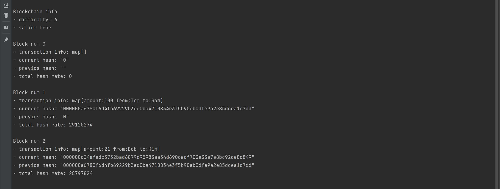
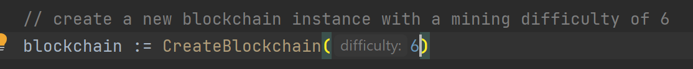
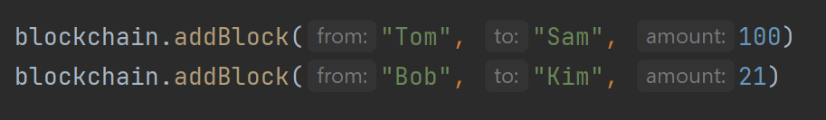

# Реализация Blockchain (PoW)
_Proof of work (PoW) — это форма добавления новых блоков транзакций в блокчейн криптовалюты. Работа в этом случае заключается в создании хэша (длинной строки символов), который соответствует целевому хешу для текущего блока._


## Результат работы




## Как использовать 

1. Создание нового Blockchain. В качестве параметра функции `CreateBlockchain()` передаётся параметр сложности. 

2. Добавление нового блока.



### Реализация:
1. Структура Blockchain
```azure
type Blockchain struct {
   genesisBlock Block
   chain        []Block
   difficulty   int
   }
 ```

2. Структура блока
```azure
type Block struct {
	data         map[string]interface{}
	hash         string
	previousHash string
	timestamp    time.Time
	pow          int
}
```